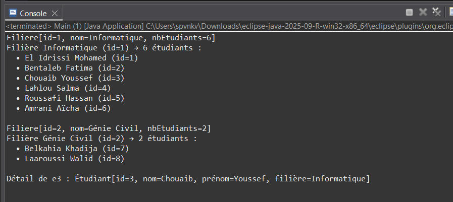

# Exercise 2: Student-Major Association (One-to-Many)



## Objective
Implement a one-to-many relationship between Filiere (Major) and Etudiant (Student) classes using dynamic arrays without advanced collections.

## Description
This exercise demonstrates bidirectional association where:
- One major (Filiere) can have multiple students
- Each student belongs to one major
- Uses dynamic array management for storing students in a major

## Class Structure

### Etudiant Class
Located in `com.example.tp` package

**Attributes:**
- `compteur` (static): Global counter for ID generation
- `id` (final): Unique identifier
- `nom`: Last name
- `prenom`: First name
- `filiere`: Reference to the student's major

**Key Methods:**
- `setFiliere(Filiere f)`: Associates student with a major
- `getFiliere()`: Returns the student's major
- `toString()`: Returns formatted information including major name

### Filiere Class

**Attributes:**
- `compteur` (static): Global counter for ID generation
- `id` (final): Unique identifier
- `nom`: Major name (e.g., "Informatique", "Génie Civil")
- `etudiants`: Dynamic array of students
- `nbEtudiants`: Current count of students

**Key Methods:**
- `ajouterEtudiant(Etudiant e)`: Adds student and establishes bidirectional link
- `afficherEtudiants()`: Displays all students in the major
- `getNbEtudiants()`: Returns student count

## Dynamic Array Management

When the student array is full:
1. Creates new array with double the capacity
2. Copies existing student references
3. Replaces old array
4. Adds the new student

## Bidirectional Association

When adding a student to a major:
```java
filiere.ajouterEtudiant(etudiant);
```
This automatically:
1. Adds student to the major's array
2. Sets the student's `filiere` reference

## Example Usage

```java
// Create majors
Filiere info = new Filiere("Informatique");
Filiere genie = new Filiere("Génie Civil");

// Create students (Moroccan names)
Etudiant e1 = new Etudiant("El Idrissi", "Mohamed");
Etudiant e2 = new Etudiant("Bentaleb", "Fatima");

// Associate students with major
info.ajouterEtudiant(e1);
info.ajouterEtudiant(e2);

// Display
info.afficherEtudiants();
```

## Expected Output

```
Filiere[id=1, nom=Informatique, nbEtudiants=6]
Filière Informatique (id=1) → 6 étudiants :
  • El Idrissi Mohamed (id=1)
  • Bentaleb Fatima (id=2)
  • Chouaib Youssef (id=3)
  • Lahlou Salma (id=4)
  • Roussafi Hassan (id=5)
  • Amrani Aïcha (id=6)

Filiere[id=2, nom=Génie Civil, nbEtudiants=2]
Filière Génie Civil (id=2) → 2 étudiants :
  • Belkahia Khadija (id=7)
  • Laaroussi Walid (id=8)

Détail de e3 : Étudiant[id=3, nom=Chouaib, prénom=Youssef, filière=Informatique]
```

## Compilation & Execution

```bash
# From src/ directory
javac com/example/tp/*.java
java com.example.tp.Main
```

## Key Concepts Demonstrated
- **One-to-Many Relationship**: One major has many students
- **Bidirectional Association**: Both classes reference each other
- **Dynamic Arrays**: Automatic capacity expansion
- **Auto-incremented IDs**: Unique identifiers across all instances

## Verification Checklist
- [ ] Auto-incremented IDs are correct and sequential
- [ ] Bidirectional link works (student knows major, major knows students)
- [ ] Dynamic array expands when needed (test with >5 students)
- [ ] Display methods show correct associations

## Possible Extensions
- Method to remove a student from a major
- Data persistence to files
- Interactive console interface or GUI
- Search functionality for students by name

## Files
- `Etudiant.java`: Student class with major reference
- `Filiere.java`: Major class with student array management
- `Main.java`: Test program with Moroccan student names
- `subject.txt`: Complete exercise specifications
