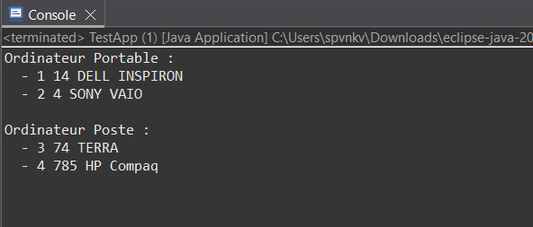

# Exercise 3: Article and Category Management



## Objective
Develop a management system for articles and categories using only arrays and loops (no collections). Demonstrates object-oriented modeling with bidirectional associations.

## Description
Based on a UML class diagram, this exercise implements:
- Category class (Categorie) for grouping articles
- Article class for individual items
- Auto-incremented IDs for unique identification
- Array-based storage and display by category

## Class Structure

### Package Structure
```
ma.projet.bean/     # Business classes
  ├── Categorie.java
  └── Article.java
ma.projet.test/     # Test classes
  └── TestApp.java
```

### Categorie Class (ma.projet.bean)

**Attributes:**
- `id` (int): Auto-incremented unique identifier
- `libelle` (String): Category label (e.g., "Ordinateur Portable")
- `code` (String): Category code (e.g., "O PR", "O PO")

**Constructor:**
```java
public Categorie(String libelle, String code)
```

**Methods:**
- `getId()`: Returns unique ID
- `getLibelle()` / `setLibelle(String)`: Label getter/setter
- `getCode()` / `setCode(String)`: Code getter/setter
- `toString()`: Returns formatted category information

### Article Class (ma.projet.bean)

**Attributes:**
- `id` (int): Auto-incremented unique identifier
- `code` (int): Article code (e.g., 14, 4, 74, 785)
- `designation` (String): Article name (e.g., "DELL INSPIRON", "SONY VAIO")
- `categorie` (Categorie): Reference to the article's category

**Constructor:**
```java
public Article(int code, String designation, Categorie categorie)
```

**Methods:**
- `getId()`: Returns unique ID
- `getCode()` / `setCode(int)`: Article code getter/setter
- `getDesignation()` / `setDesignation(String)`: Name getter/setter
- `getCategorie()` / `setCategorie(Categorie)`: Category getter/setter
- `toString()`: Returns exactly "id code designation" format

## Test Implementation (TestApp)

Using **only arrays and loops** (no List/Map/Stream):

1. Create 2 categories in a `Categorie[]` array:
   - Ordinateur Portable (O PR)
   - Ordinateur Poste (O PO)

2. Create 4 articles in an `Article[]` array:
   - First two belong to "Ordinateur Portable"
   - Last two belong to "Ordinateur Poste"
   - Use codes: 14, 4, 74, 785

3. Display articles grouped by category using nested loops:
   - Outer loop: iterate through categories
   - Inner loop: find articles matching each category ID

## Example Output

```
Ordinateur Portable :
  - 1 14 DELL INSPIRON
  - 2 4 SONY VAIO

Ordinateur Poste :
  - 3 74 TERRA
  - 4 785 HP Compaq
```

## Output Format Requirements
- Each article line: `- id code designation`
- Format comes from Article's `toString()` method
- Spacing and order must match the example exactly

## Implementation Constraints

### Required
- **Mandatory packages**: `ma.projet.bean` (business), `ma.projet.test` (testing)
- **Auto-increment**: Via static field per class (starts at 1)
- **Arrays + Loops only**: No collections (List, Map, Set, Stream)
- **Exact format**: Output must match the example spacing and order

### Algorithm for Display
```java
for (each category in categories array) {
    print category name
    for (each article in articles array) {
        if (article.getCategorie().getId() == category.getId()) {
            print "  - " + article.toString()
        }
    }
}
```

## Sample Data

**Categories:**
1. Ordinateur Portable (code: O PR)
2. Ordinateur Poste (code: O PO)

**Articles:**
- Article 1: code=14, designation="DELL INSPIRON", category=Ordinateur Portable
- Article 2: code=4, designation="SONY VAIO", category=Ordinateur Portable
- Article 3: code=74, designation="TERRA", category=Ordinateur Poste
- Article 4: code=785, designation="HP Compaq", category=Ordinateur Poste

## Verification Criteria
- [ ] Correct package structure (ma.projet.bean, ma.projet.test)
- [ ] Auto-incremented IDs starting from 1
- [ ] Only arrays and loops used (no collections)
- [ ] Output format matches example exactly
- [ ] All articles display under correct category

## Key Learning Points
- Object-oriented modeling from UML diagrams
- Auto-increment ID pattern with static fields
- Association between classes (Article references Categorie)
- Array-based data storage without collections
- Nested loop algorithms for filtering and display

## Files
- `Categorie.java`: Category class implementation
- `Article.java`: Article class with category reference
- `TestApp.java`: Test program with array-based operations
- `subject.txt`: Complete exercise specifications with UML diagram
