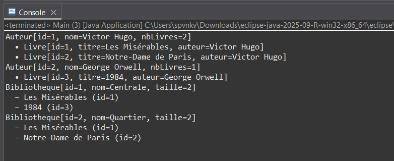

# Exercise 4: Library Management System (Authors, Books, Libraries)



## Objective
Implement a comprehensive library management system demonstrating:
- Object instantiation and class creation
- One-to-many association (Author → Books)
- Many-to-many association (Library ↔ Books)
- Auto-incremented unique IDs for all entities
- Bidirectional relationships between objects

## Description
This advanced exercise creates a complete library system with three interconnected classes. It demonstrates real-world object-oriented modeling with proper association management.

## UML Model

```
    Auteur              Livre             Bibliotheque
 ┌───────────┐       ┌────────┐       ┌─────────────────┐
 │ id        │1    * │ id     │  *  * │ id              │
 │ nom       │──────▶│ titre  │◀──────│ nom             │
 │ livres    │       │ auteur │       │ collection      │
 └───────────┘       └────────┘       └─────────────────┘
```

## Class Structure

### Auteur (Author) Class
Located in `com.example.tp` package

**Attributes:**
- `compteur` (static int): Global counter for ID generation
- `id` (final int): Unique identifier
- `nom` (String): Author's name
- `livres` (List<Livre>): Books written by this author

**Constructor:**
```java
public Auteur(String nom)
```
- Auto-increments ID
- Initializes empty book list

**Methods:**
- `getId()`: Returns unique ID
- `getNom()`: Returns author name
- `getLivres()`: Returns list of books
- `ajouterLivre(Livre livre)`: Adds book to author's list (checks for duplicates)
- `toString()`: Returns formatted author info with book count

### Livre (Book) Class

**Attributes:**
- `compteur` (static int): Global counter for ID generation
- `id` (final int): Unique identifier
- `titre` (String): Book title
- `auteur` (Auteur): Reference to the book's author

**Constructor:**
```java
public Livre(String titre, Auteur auteur)
```
- Auto-increments ID
- Sets title and author
- **Automatically establishes bidirectional link** with author

**Methods:**
- `getId()`: Returns unique ID
- `getTitre()`: Returns book title
- `getAuteur()`: Returns author reference
- `toString()`: Returns formatted book info with author name

### Bibliotheque (Library) Class

**Attributes:**
- `compteur` (static int): Global counter for ID generation
- `id` (final int): Unique identifier
- `nom` (String): Library name
- `collection` (Set<Livre>): Books in library (uses Set to avoid duplicates)

**Constructor:**
```java
public Bibliotheque(String nom)
```
- Auto-increments ID
- Initializes empty collection

**Methods:**
- `getId()`: Returns unique ID
- `getNom()`: Returns library name
- `getCollection()`: Returns book collection
- `ajouterLivre(Livre livre)`: Adds book to collection
- `toString()`: Returns formatted library info with collection size

## Associations Explained

### One-to-Many: Author → Books
- One author writes many books
- Each book has exactly one author
- Bidirectional: Book knows its author, author knows its books
- Managed via `List<Livre>` in Author

### Many-to-Many: Library ↔ Books
- One library contains many books
- One book can be in multiple libraries
- Managed via `Set<Livre>` in Library (prevents duplicates)

## Example Usage

```java
// Create authors
Auteur hugo = new Auteur("Victor Hugo");
Auteur orwell = new Auteur("George Orwell");

// Create books (automatic bidirectional linking)
Livre m1 = new Livre("Les Misérables", hugo);
Livre ndp = new Livre("Notre-Dame de Paris", hugo);
Livre l1984 = new Livre("1984", orwell);

// Create libraries
Bibliotheque centrale = new Bibliotheque("Centrale");
Bibliotheque quartier = new Bibliotheque("Quartier");

// Add books to libraries
centrale.ajouterLivre(m1);
centrale.ajouterLivre(l1984);
quartier.ajouterLivre(m1);
quartier.ajouterLivre(ndp);

// Display results
System.out.println(hugo);
hugo.getLivres().forEach(l -> System.out.println("  • " + l));
```

## Expected Output

```
Auteur[id=1, nom=Victor Hugo, nbLivres=2]
  • Livre[id=1, titre=Les Misérables, auteur=Victor Hugo]
  • Livre[id=2, titre=Notre-Dame de Paris, auteur=Victor Hugo]
Auteur[id=2, nom=George Orwell, nbLivres=1]
  • Livre[id=3, titre=1984, auteur=George Orwell]
Bibliotheque[id=1, nom=Centrale, taille=2]
  – Les Misérables (id=1)
  – 1984 (id=3)
Bibliotheque[id=2, nom=Quartier, taille=2]
  – Les Misérables (id=1)
  – Notre-Dame de Paris (id=2)
```

## Compilation & Execution

```bash
# From src/ directory
javac com/example/tp/*.java
java com.example.tp.Main
```

## Key Features

### Auto-Incremented IDs
- Each class maintains its own static counter
- IDs are unique within each class type
- Counter increments with each new instance

### Bidirectional Association (Author-Book)
- Book constructor automatically adds itself to author's list
- Both objects maintain references to each other
- Ensures consistency of relationship

### Many-to-Many with Set
- Uses `Set<Livre>` to prevent duplicate books
- Same book can exist in multiple libraries
- No reciprocal reference from Book to Library (unidirectional many-to-many)

## Verification Checklist
- [ ] Each class has unique auto-incremented IDs
- [ ] Bidirectional Author↔Book association works correctly
- [ ] Many-to-many Library↔Books functions via Set
- [ ] Same book can appear in multiple libraries
- [ ] No duplicate books in a single library

## Possible Extensions
1. **Remove Operations**:
   - `supprimerLivre()` in Author and Library with reciprocal updates

2. **Genre System**:
   - Create Genre class
   - Associate multiple genres with books

3. **Persistence**:
   - JSON serialization
   - Binary file storage
   - Database integration

4. **User Interface**:
   - Swing/JavaFX GUI
   - Interactive navigation between objects
   - Search and filter capabilities

5. **Additional Features**:
   - Book availability tracking
   - Borrowing system
   - Due dates and fines
   - ISBN management

## Prerequisites
- JDK 8 or higher
- Understanding of Java collections (List, Set)
- Knowledge of object associations
- Familiarity with lambda expressions (for forEach)

## Files
- `Auteur.java`: Author class with book list management
- `Livre.java`: Book class with bidirectional author link
- `Bibliotheque.java`: Library class with book collection
- `Main.java`: Test program demonstrating all features
- `subject.txt`: Complete exercise specifications
